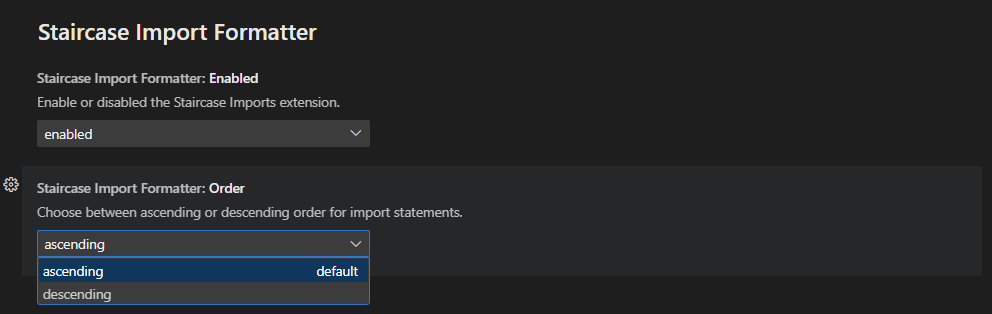

# Staircase Imports for VSCode


## Overview
Staircase Imports formats your import statements into a staircase like structure, ensuring that your imports are organized and look cool.

## Usage
Simply work on your Python files as usual. When you save your file, Staircase Imports automatically formats the import statements in your file, organizing them into a neat structure.

## Supported Languages
- Python (fully supported)
- JavaScript/TypeScript (fully supported)
- Support for other languages are in the works.

## Installation
1. Open Visual Studio Code.
2. Navigate to the Extensions view.
3. Search for "Staircase Imports".
4. Click on the Install button to install the extension.

## Extension Settings
1. Choose to enable or disable the extension.
2. Choose to format your imports in ascending or descending order.

For example:
ascending:
```python
import os
import sys
import time
```

descending:
```python
import time
import sys
import os
```

### Settings Preview:


## Contributing
We welcome contributions and suggestions! Feel free to open an issue or submit a pull request on our [GitHub repository](https://github.com/MyPingO/staircase-imports).

## License
This extension is licensed under [MIT License](LICENSE).

## Release Notes
[Check out the Changelog for all updates](CHANGELOG.md)

---

**Enjoy!**
